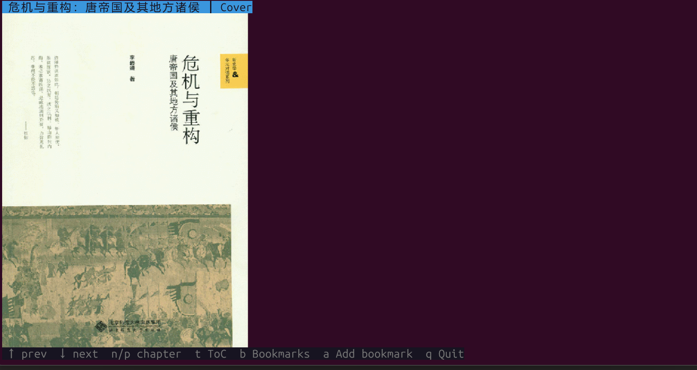

# ink-reader

> Ink on the terminal — read ebooks in your terminal.

A fast, keyboard-driven TUI e-book reader for Linux/macOS built with Rust and
[Ratatui](https://github.com/ratatui/ratatui). Open EPUB and TXT files without
leaving the command line. It now renders book
cover art and inline illustrations directly inside supported terminals.


[](https://github.com/AlexiaChen/ink-reader/actions/workflows/ci.yml)


---

## Preview

<table>
  <tr>
    <td align="center" width="50%">
      
    </td>
    <td align="center" width="50%">
      
    </td>
  </tr>
  <tr>
    <td align="center"><strong>Cover art</strong><br />Open a book and see its cover before you start reading.</td>
    <td align="center"><strong>Inline illustrations</strong><br />Keep images and nearby captions in the reading flow.</td>
  </tr>
</table>

Image rendering uses terminal image protocols when available and gracefully
falls back so reading still works in text-only environments.

---

## Features

| Feature | Details |
|---------|---------|
| **Format support** | EPUB, TXT |
| **Table of Contents** | Overlay (`t`) to jump to any chapter instantly |
| **Bookmarks** | Add (`a`), browse (`b`), delete (`d`), jump to any bookmark |
| **Page navigation** | `↓` / `Space` next page · `↑` prev page |
| **Chapter navigation** | `n` next chapter · `p` prev chapter |
| **Page-flip animation** | Smooth fan-in/fan-out effect when turning pages |
| **Paragraph indent** | 4-space first-line indent for comfortable reading |
| **Cover art** | Displays EPUB covers in-terminal when image rendering is available |
| **Inline illustrations** | Renders chapter images in place and keeps nearby captions with the figure |
| **Persistent state** | Bookmarks saved to `~/.local/share/ink-reader/bookmarks.json` |
| **Responsive layout** | Reflows text automatically on terminal resize |

---

## Installation

### Prerequisites

- Rust toolchain (edition 2024) — install via [rustup](https://rustup.rs/)

### From source

```bash
git clone https://github.com/AlexiaChen/ink-reader
cd ink-reader
cargo build --release
# binary at: target/release/ink-reader
```

### System-wide install

```bash
# without sudo
cargo install --path .

# with sudo (Makefile handles the rustup HOME quirk automatically)
sudo make install
```

---

## Usage

```
ink-reader <FILE>
```

### Keyboard shortcuts

#### Reading mode

| Key | Action |
|-----|--------|
| `↓` / `Space` | Next page |
| `↑` | Previous page |
| `n` | Next chapter |
| `p` | Previous chapter |
| `t` | Open Table of Contents |
| `b` | Open Bookmarks |
| `a` | Add bookmark at current position |
| `q` / `Esc` / `Ctrl-c` | Quit |

#### Table of Contents overlay (`t`)

| Key | Action |
|-----|--------|
| `↑` / `k` | Move selection up |
| `↓` / `j` | Move selection down |
| `Enter` | Jump to selected chapter |
| `t` / `q` / `Esc` | Close overlay |

#### Bookmarks overlay (`b`)

| Key | Action |
|-----|--------|
| `↑` / `k` | Move selection up |
| `↓` / `j` | Move selection down |
| `Enter` | Jump to selected bookmark |
| `d` | Delete selected bookmark |
| `b` / `q` / `Esc` | Close overlay |

---

## Build & Development

```bash
# Check formatting
cargo fmt --check

# Run clippy with CI-level strictness
cargo clippy --all-targets -- -D warnings

# Build (also runs clippy)
make build

# Run tests
make test

# Install to /usr/local/bin
make install

# Remove build artifacts
make clean
```

## CI

GitHub Actions runs on pull requests and pushes to `master`, checking:

- `cargo fmt --check`
- `cargo clippy --all-targets -- -D warnings`
- `cargo test`
- `cargo build --release`

---

## Project structure

```
src/
├── main.rs          # Entry point — event loop, terminal setup/teardown
├── app.rs           # Application state machine (reading / ToC / bookmarks modes)
├── book.rs          # Core types, pagination, text-wrapping
├── formats/
│   ├── epub.rs      # EPUB reader (rbook)
│   └── txt.rs       # Plain-text reader
├── storage.rs       # Bookmark persistence (JSON via serde)
└── ui/
    └── reader.rs    # Ratatui rendering (status bar, content, help bar, animation)
```

---

## Dependencies

| Crate | Purpose |
|-------|---------|
| `ratatui` | Terminal UI framework |
| `crossterm` | Cross-platform terminal control |
| `ratatui-image` | Inline image rendering |
| `rbook` | EPUB parsing |
| `html2text` | HTML-to-plain-text for EPUB content |
| `textwrap` | Unicode-aware text wrapping with indent support |
| `clap` | CLI argument parsing |
| `serde` / `serde_json` | Bookmark serialization |

---

## License

MIT — see [LICENSE](LICENSE).
