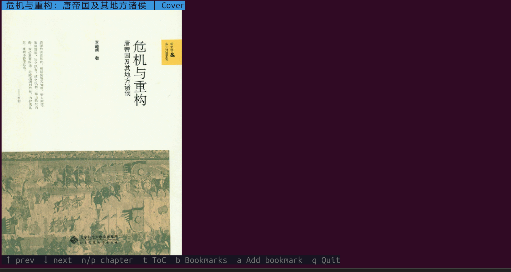
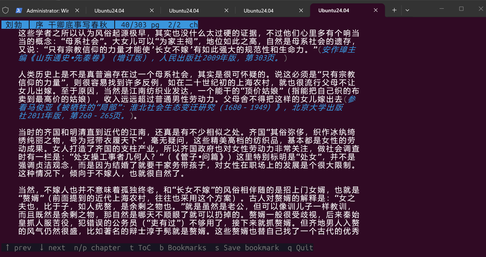

# ink-reader

> Ink on the terminal — read ebooks in your terminal.

A fast, keyboard-driven TUI e-book reader for Linux/macOS built with Rust and
[Ratatui](https://github.com/ratatui/ratatui). Open EPUB, PDF, and TXT files without
leaving the command line. It now renders book cover art, expands footnotes into
styled inline references, and shows inline illustrations directly inside
supported terminals.


[](https://github.com/AlexiaChen/ink-reader/actions/workflows/ci.yml)


---

## Preview

<table>
  <tr>
    <td align="center" width="33.33%">
      
    </td>
    <td align="center" width="33.33%">
      
    </td>
    <td align="center" width="33.33%">
      
    </td>
  </tr>
  <tr>
    <td align="center"><strong>Cover art</strong><br />Open a book and see its cover before you start reading.</td>
    <td align="center"><strong>Inline illustrations</strong><br />Keep images and nearby captions in the reading flow.</td>
    <td align="center"><strong>Inline references</strong><br />Expand EPUB footnotes into readable inline notes with distinct styling.</td>
  </tr>
</table>

Image rendering uses terminal image protocols when available and gracefully
falls back so reading still works in text-only environments.

---

## Features

| Feature | Details |
|---------|---------|
| **Format support** | EPUB, PDF, TXT |
| **Table of Contents** | Overlay (`t`) for EPUB chapters and native PDF outlines; PDFs without an outline fall back to page navigation |
| **Bookmarks** | Save/overwrite (`s`), browse (`b`), delete (`d`), jump to the saved bookmark |
| **Page navigation** | `↓` / `Space` next page · `↑` prev page |
| **Chapter navigation** | `n` next chapter · `p` prev chapter |
| **Page-flip animation** | Smooth fan-in/fan-out effect when turning pages |
| **Paragraph indent** | 4-space first-line indent for comfortable reading |
| **Cover art** | Displays EPUB covers and a rendered PDF first page in-terminal when image rendering is available |
| **Styled headings** | Keeps extracted EPUB/PDF heading markers like `#` / `##` visible while colorizing heading lines by level |
| **Inline references** | Expands EPUB footnote/reference markers like `[4]` into parenthesized inline citation text with distinct styling |
| **Inline illustrations** | Renders EPUB illustrations in place and displays images extracted from PDF page content streams and nested Form XObjects |
| **PDF tables** | Uses PDF Oxide's tagged/spatial table detection and keeps extracted tables as readable terminal text |
| **Persistent state** | One bookmark per book, auto-saved on quit to `~/.local/share/ink-reader/bookmarks.json` |
| **Responsive layout** | Reflows text automatically on terminal resize |
| **Reading Copilot** | A private-by-default Rig agent in a streaming right panel, with terminal-native LaTeX math rendering alongside the visible source page |

---

## Installation

### Prerequisites

- Rust toolchain (edition 2024) — install via [rustup](https://rustup.rs/)
- Optional: [Ollama](https://ollama.com/download) for the Reading Copilot. The reader builds and runs without it.

For a persistent user-level Ollama installation on systemd Linux/WSL2, see the
[service setup](doc/reading-copilot.md#wsl2-and-desktop-linux).

### From source

```bash
git clone https://github.com/AlexiaChen/ink-reader
cd ink-reader
cargo build --release
# binary at: target/release/ink-reader
```

### System-wide install

```bash
# without sudo
cargo install --path .

# with sudo (Makefile handles the rustup HOME quirk automatically)
sudo make install
```

---

## Usage

```
ink-reader <FILE>
```

Copilot provider settings can be supplied by CLI or environment:

```bash
ink-reader book.pdf \
  --ollama-url http://127.0.0.1:11434 \
  --copilot-model qwen3.5:4b \
  --copilot-reasoning-model phi4-mini-reasoning
```

Equivalent environment variables are `INK_READER_OLLAMA_URL`,
`INK_READER_COPILOT_MODEL`, `INK_READER_COPILOT_REASONING_MODEL`, and
`INK_READER_OLLAMA_API_KEY`. `OLLAMA_API_KEY` is also recognized. The default
endpoint is local and does not require a key.

### Keyboard shortcuts

#### Reading mode

| Key | Action |
|-----|--------|
| `↓` / `Space` | Next page |
| `↑` | Previous page |
| `n` | Next chapter |
| `p` | Previous chapter |
| `c` | Open Reading Copilot for the visible page |
| `t` | Open Table of Contents |
| `b` | Open Bookmarks |
| `s` | Save or overwrite the bookmark at the current position |
| `q` / `Esc` / `Ctrl-c` | Quit |

#### Table of Contents overlay (`t`)

| Key | Action |
|-----|--------|
| `↑` / `k` | Move selection up |
| `↓` / `j` | Move selection down |
| `Enter` | Jump to selected chapter |
| `t` / `q` / `Esc` | Close overlay |

#### Bookmarks overlay (`b`)

| Key | Action |
|-----|--------|
| `↑` / `k` | Move selection up |
| `↓` / `j` | Move selection down |
| `Enter` | Jump to selected bookmark |
| `d` | Delete selected bookmark |
| `b` / `q` / `Esc` | Close overlay |

#### Reading Copilot panel (`c`)

| Key | Action |
|-----|--------|
| `e` | Explain the page's concepts, argument, and assumptions |
| `t` | Translate the page into Simplified Chinese |
| `s` | Produce a study-oriented summary |
| `r` | Run deeper mathematical/logical analysis; retry on result/error screens |
| `a` | Type a custom question or follow-up |
| `j` / `k` | Scroll the streamed answer |
| `x` | Cancel an active request |
| `Esc` / `c` | Close the panel |

On terminals at least 90 columns wide, the reading page remains visible on the
left while Copilot occupies a bounded 40–64 column panel on the right. Narrower
terminals fall back to a full-screen Copilot view. Opening or closing the panel
reflows the page to its actual pane width while preserving the approximate
chapter position.

The panel displays whether its endpoint is local or remote. Only the text on
the visible reading page is supplied to the agent; opening the menu does not
send anything. Remote endpoints are opt-in because excerpts leave the machine.
See [Reading Copilot design and setup](doc/reading-copilot.md).

Completed `$...$` and `$$...$$` TeX regions in Copilot answers are parsed as
Markdown math and rendered as two-dimensional Unicode notation. Fractions,
roots, limits, integrals, and matrices therefore remain aligned while scrolling
and copying like ordinary terminal text. An unfinished formula stays as source
text during streaming; over-wide or unsafe formulas retain a visible LaTeX
fallback instead of being silently truncated.

---

## Build & Development

```bash
# Check formatting
cargo fmt --check

# Run clippy with CI-level strictness
cargo clippy --all-targets -- -D warnings

# Build (also runs clippy)
make build

# Run tests
make test

# Install to /usr/local/bin
make install

# Remove build artifacts
make clean
```

## CI

GitHub Actions runs on pull requests and pushes to `master`, checking:

- `cargo fmt --check`
- `cargo clippy --all-targets -- -D warnings`
- `cargo test`
- `cargo build --release`

---

## Project structure

```
src/
├── main.rs          # Entry point — event loop, terminal setup/teardown
├── app.rs           # Application state machine (reading / ToC / bookmarks modes)
├── book.rs          # Core types, pagination, text-wrapping
├── copilot.rs       # Rig reading agent, provider config, and background stream state
├── math_render.rs   # Markdown math parsing and 2D Unicode LaTeX rendering
├── formats/
│   ├── epub.rs      # EPUB reader (rbook)
│   ├── pdf.rs       # PDF text/table/image/outline reader (pdf_oxide)
│   └── txt.rs       # Plain-text reader
├── storage.rs       # Bookmark persistence (JSON via serde)
└── ui/
    ├── copilot.rs   # Reading Copilot right panel
    └── reader.rs    # Ratatui rendering (status bar, content, help bar, animation)
```

---

## Dependencies

| Crate | Purpose |
|-------|---------|
| `ratatui` | Terminal UI framework |
| `crossterm` | Cross-platform terminal control |
| `ratatui-image` | Inline image rendering |
| `rbook` | EPUB parsing |
| `html2text` | HTML-to-plain-text for EPUB content |
| `pdf_oxide` | PDF metadata, outline, text/table/image extraction, and first-page rendering |
| `textwrap` | Unicode-aware text wrapping with indent support |
| `pulldown-cmark` / `term-maths` | Markdown math detection and terminal-native 2D LaTeX rendering |
| `clap` | CLI argument parsing |
| `serde` / `serde_json` | Bookmark serialization |
| `rig-core` | Agent abstraction, Ollama provider, streaming, and future tools/RAG |
| `tokio` / `futures-util` | Background agent runtime and streaming response handling |

---

## License

MIT — see [LICENSE](LICENSE).
